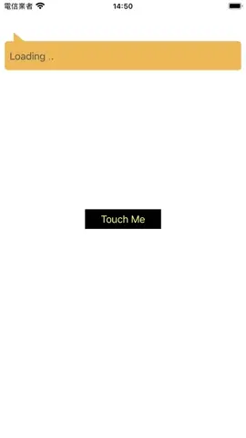

# WWLabel
[](https://developer.apple.com/swift/) [](https://developer.apple.com/swift/)  [](https://developer.apple.com/swift/) [](https://developer.apple.com/swift/)

## [Introduction - 簡介](https://swiftpackageindex.com/William-Weng)
- Enhance the function of UILabel (add Loading text display).
- 增強UILabel的功能 (加上Loading文字顯示)。



## [Installation with Swift Package Manager](https://medium.com/彼得潘的-swift-ios-app-開發問題解答集/使用-spm-安裝第三方套件-xcode-11-新功能-2c4ffcf85b4b)
```bash
dependencies: [
    .package(url: "https://github.com/William-Weng/WWLabel.git", .upToNextMajor(from: "1.0.0"))
]
```

## 可用函式
|函式|說明|
|-|-|
|startLoadingText(_:prefixString:textColor:timeInterval:font:)|開始Loading文字|
|stopLoadingText()|停止Loading文字|

## [Example](https://ezgif.com/video-to-webp)
```swift
import UIKit
import WWLabel

final class ViewController: UIViewController {

    @IBOutlet weak var myLabel: WWLabel!
    
    override func viewDidLoad() {
        super.viewDidLoad()
        _ = myLabel.startLoadingText(prefixString: "Loading")
    }
    
    @IBAction func stopLoading(_ sender: UIButton) {
        myLabel.stopLoadingText()
        myLabel.text = "iPhone 16e has an incredible design — inside and out — and is available in an elegant black or white finish. Made from durable aerospace‑grade aluminum, the enclosure on iPhone 16e is built to go the distance and survive life’s oops, whoops, and oh nooos."
    }
}
```
